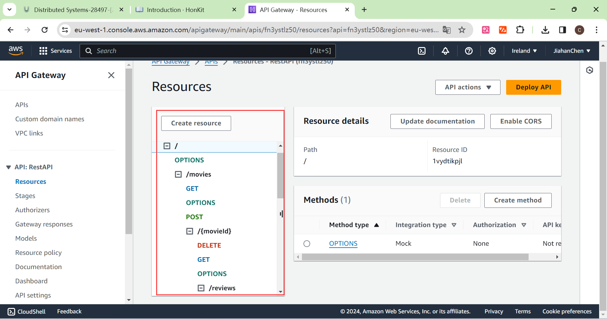
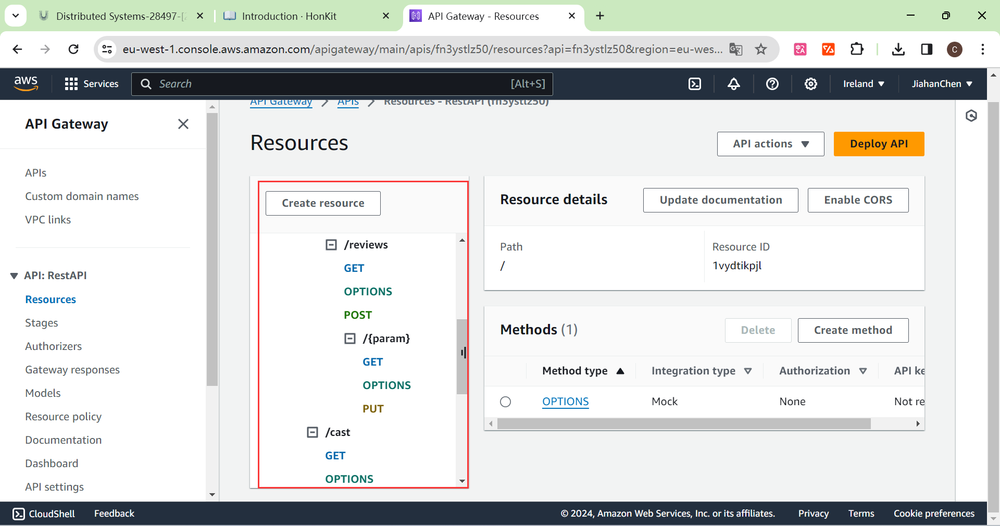
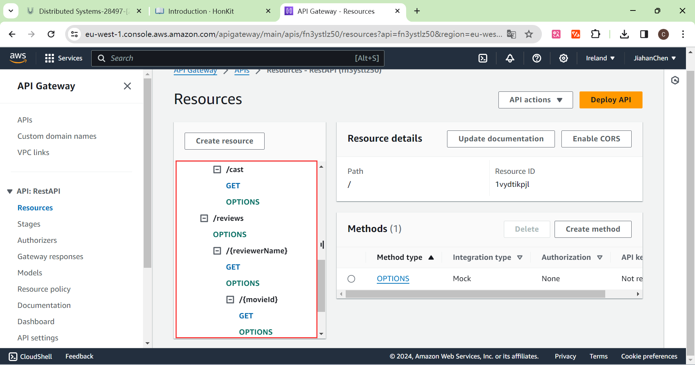
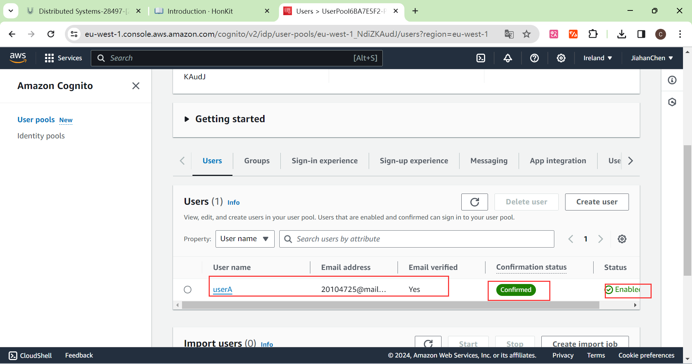

## Serverless REST Assignment.

__Name:__ Jiahan Chen

__Video demonstration:__ https://youtu.be/VUIo6L_4Y8w

This repository contains an implementation of a serverless REST API for the AWS platform. The CDK framework is used to provision its infrastructure. The API's domain context is movie reviews.

### API endpoints.

+ POST /movies/{movieId}/reviews - add a movie review.
+ GET /movies/{movieId}/reviews - Get all the reviews for a movie with the specified id.
+ GET /movies/{movieId}/reviews?minRating=n - Get all the reviews for the film with the specified ID whose rating was higher than the minRating.
+ GET /movies/{movieId}/reviews/{param} - Get the review for the movie with the specified movie ID and written param. The param can be reviewer name and year. If the param is reviewer name, we get the review from specific reviewer name and movie ID. If the param is year, we get reviews from movie ID in the given year.
+ PUT /movies/{movieId}/reviews/{param} - Update the text of a review by given movie Id and param, This param can only be the viewer name.
+ GET /reviews/{reviewerName} - Get all the reviews written by a specific reviewer.
+ GET /reviews/{reviewerName}/{movieId} - Get the movie review using the movie ID and reviewer name as the identifier.
+ GET /reviews/{reviewerName}/{movieId}/translation?language=code - Get a translated version of a movie review using the movie ID and reviewer name as the identifier.

### Authentication

### Independent learning

In the experimental process, in the call translation API I need to first understand the API need to pass in the parameters, to understand the need to pass in a need to translate the text, the other is to translate the language, we here the default setting of the language to be translated into English, so just need to set the parameters need to be passed in for the text and the target language;

In addition, for different path parameter names, such as reviewerName or year filtering, for the computer, they are the same path, so we need to determine their own passed in is the year or reviewerName, and then for different parameters to apply different filtering algorithms.

